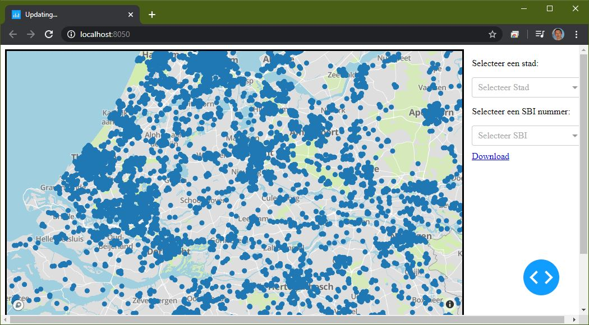

# Dashboard for spatial datasets
This repository provides the code made by [Software Engineering](https://studiegids.universiteitleiden.nl/en/courses/85177/software-engineering) students. The goal was to make a dashboard framework in Python, which allows the [Human Environmental and Transport Inspectorate (ILT)](https://www.ilent.nl/).

We provided the [studentteam](#authors) with the following additional wishes:
- Code written as universal/ modular as possible: we would be happy to re-use the set-up for future projects and to ensure consistency between different plots/visualizations within a dashboard.
- If possible, we would like to be able to exchange the code for re-use on other platforms (mainly R) with as little changes in the code as necessary.
- Take into account computational efficiency of loading, filtering, and rendering plots and tables , especially when it comes to the inclusion of several ‘heavy’ geo-plots.
- Include calls for data from PostGres/ PostGIS to support both computational efficiency as well as inclusion of automatically updated data sources.
- Ideas on how to visualize data and insights are appreciated.

## Getting started
*This section still needs to be written.* There is a [documentation file](documentation.md) provided by the student team.

### Prerequisites
Linux server that runs:
- SQL database
- Python 3.3 or later

### Installing

1. Make sure that you have in `data/` two files: a .csv containing the data and a .specification.json. An example of the latter is provided in `data/kvk.specification.json`. Here we provide the md5sum for the demonstration files.
```bash
$ md5sum data/*
a52284c681ee95173b3ffcf09e4766fb  data/kvk.csv
7a01b92170423689efe17cb64456804f  data/kvk.specification.json
a3e624961f98507b28887946636aa9d3  data/sbi_names.csv
8e33af7f036420dacd955d4d8d34ee44  data/sbi_names.specification.json
```
2. Create a virtual python environment (make sure that Python >= 3.3).
```bash
python3 -m venv environment
source environment/bin/activate
```

3. Install required packages from `requirements.txt`.
```bash
pip install -r requirements
```

4. Provide database information in `connect_database.py`. Or make sure that the environmental variables `DBUSER`, `DBPASS`, `HOST`, `DB`, `TOKEN` contain resp. the username, password, URL, database name of the SQL server, while the `TOKEN` should be obtained at https://docs.mapbox.com/help/glossary/access-token. The token is used to draw the map.
```bash
echo "export HOST='mysql.liacs.leidenuniv.nl'
export DBUSER='bruingjde'
export DBPASS=''
export DB='bruingjde'
export TOKEN=''" >> ~/.bash_aliases
```

5. Import the csv-files to the server. 
:warning: **This can take up to a day.**
```bash
python upload_database.py data/kvk.csv data/kvk.specification.json 
python upload_database.py data/sbi_names.csv data/sbi_names.specification.json
```

6. Run the server!
```bash
python server.py
```

7. Open http://localhost:8050 in a webbrowser.


## Contributions
### Authors
- Mark Kompier
- Richard Hoogduin
- Rogier van den Burgh
- [Romke Bak](https://nl.linkedin.com/in/romke-bak-00000a135)
- [Stijn Boere](https://home.strw.leidenuniv.nl/~boere/)

### Supervision
- [Noortje Groot](https://nl.linkedin.com/in/noortjegroot)
- [Gerben van Baren](https://nl.linkedin.com/in/gerben-van-baren-5805554)
- [Gerrit-Jan de Bruin](http://gerritjandebruin.nl/)

## License
*We did not decide yet.*